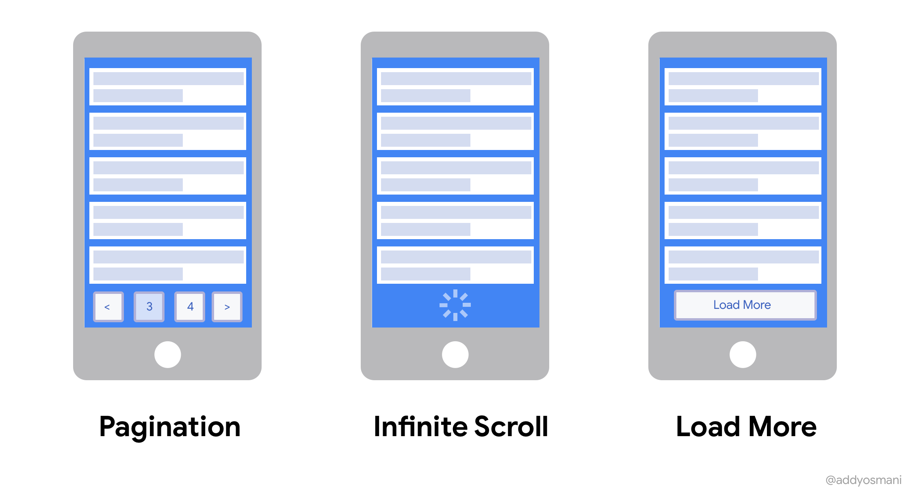

# ¿ Qué es un Scroll Infinito?



El desplazamiento infinito se ha convertido en una técnica popular en el desarrollo web para brindar una experiencia de usuario fluida y dinámica al trabajar con grandes conjuntos de datos. Permite a los usuarios desplazarse por el contenido sin fin sin paginación explícita ni carga de páginas nuevas.

Una de las formas más comunes de implementar el scroll infinito en React es a través de las librerías de React, siguiendo este código:

```JavaScript
import React, { useState, useEffect } from "react";
import InfiniteScroll from "react-infinite-scroll-component";
import axios from "axios";
import ProductCard from "./ProductCard";
import Loader from "./Loader";

const InfiniteScrollExample1 = () => {
  const [items, setItems] = useState([]);
  const [hasMore, setHasMore] = useState(true);
  const [index, setIndex] = useState(2);

  useEffect(() => {
    axios
      .get("https://api.escuelajs.co/api/v1/products?offset=10&limit=12")
      .then((res) => setItems(res.data))
      .catch((err) => console.log(err));
  }, []);

  const fetchMoreData = () => {
    axios
      .get(`https://api.escuelajs.co/api/v1/products?offset=${index}0&limit=12`)
      .then((res) => {
        setItems((prevItems) => [...prevItems, ...res.data]);

        res.data.length > 0 ? setHasMore(true) : setHasMore(false);
      })
      .catch((err) => console.log(err));

    setIndex((prevIndex) => prevIndex + 1);
  };

  return (
    <InfiniteScroll
      dataLength={items.length}
      next={fetchMoreData}
      hasMore={hasMore}
      loader={<Loader />}
    >
      <div className='container'>
        <div className='row'>
          {items &&
            items.map((item) => <ProductCard data={item} key={item.id} />)}
        </div>
      </div>
    </InfiniteScroll>
  );
};

export default InfiniteScrollExample1;
```

Exploraremos cómo implementar el desplazamiento infinito en una aplicación React, utilizando sus capacidades de virtualización y optimizando el rendimiento.

## Uso de las bibliotecas de React

Para comenzar a implementar el desplazamiento infinito en su aplicación React, necesitamos instalar algunas dependencias. La biblioteca más utilizada para este propósito es react-infinite-scroll-component. Puede instalarla usando npm:

```
npm install react-infinite-scroll-component axios
```

Después de esto necesitamos importar los componentes.

```JavaScript
import React, { useState, useEffect } from "react";
import InfiniteScroll from "react-infinite-scroll-component";
```

Establece los estados iniciales de nuestro componente. Esto incluye una lista de elementos, indicadores de carga y variables que almacenan el índice de la página siguiente.

```JavaScript
import React, { useState, useEffect } from "react";
import InfiniteScroll from "react-infinite-scroll-component";
import axios from "axios";

const InfiniteScrollExample1 = () => {
    const [items, setItems] = useState([]);
    const [hasMore, setHasMore] = useState(true);
    const [index, setIndex] = useState(2);

  // Rest of the components
```
Ahora, veamos cómo se obtienen los datos desde el back end. Aquí usamos la biblioteca Axios y Platzi Fake Store para obtener datos ficticios.

Entonces, hay dos partes en el código. Primero, usando el gancho useEffect, recuperamos el conjunto de productos inicial de la API y actualizamos la variable de estado de los elementos con los datos de la respuesta de la API resuelta.

La segunda parte, la función fetchMoreData, se define por separado para manejar la obtención de más datos cuando el usuario llega al final de la página o activa un evento específico.

Cuando vuelven los nuevos datos, los agrega a los productos existentes en la variable de elementos. También verifica si quedan más productos para cargar y, si es así, establece una variable llamada hasMore en true, para que sepamos que podemos cargar más más tarde.

El final de la función fechMoreData actualiza el estado del índice.

```JavaScript
 useEffect(() => {
    axios
      .get("https://api.escuelajs.co/api/v1/products?offset=10&limit=12")
      .then((res) => setItems(res.data))
      .catch((err) => console.log(err));
  }, []);

  const fetchMoreData = () => {
    axios
      .get(`https://api.escuelajs.co/api/v1/products?offset=${index}0&limit=12`)
      .then((res) => {
        setItems((prevItems) => [...prevItems, ...res.data]);

        res.data.length > 0 ? setHasMore(true) : setHasMore(false);
      })
      .catch((err) => console.log(err));

    setIndex((prevIndex) => prevIndex + 1);
  };
```

Luego, envuelva la lista de elementos en el componente InfiniteScroll. Configure el componente pasando las propiedades necesarias como dataLength, next, hasMore y loader:
```JavaScript
return (
    <InfiniteScroll
      dataLength={items.length}
      next={fetchMoreData}
      hasMore={hasMore}
      loader={<Loader />}
    >
      <div className='container'>
        <div className='row'>
          {items &&
            items.map((item) => <ProductCard data={item} key={item.id} />)}
        </div>
      </div>
    </InfiniteScroll>
  );
```

El código completo se vería así:

```JavaScript
import React, { useState, useEffect } from "react";
import InfiniteScroll from "react-infinite-scroll-component";
import axios from "axios";
import ProductCard from "./ProductCard";
import Loader from "./Loader";

const InfiniteScrollExample1 = () => {
  const [items, setItems] = useState([]);
  const [hasMore, setHasMore] = useState(true);
  const [index, setIndex] = useState(2);

  useEffect(() => {
    axios
      .get("https://api.escuelajs.co/api/v1/products?offset=10&limit=12")
      .then((res) => setItems(res.data))
      .catch((err) => console.log(err));
  }, []);

  const fetchMoreData = () => {
    axios
      .get(`https://api.escuelajs.co/api/v1/products?offset=${index}0&limit=12`)
      .then((res) => {
        setItems((prevItems) => [...prevItems, ...res.data]);

        res.data.length > 0 ? setHasMore(true) : setHasMore(false);
      })
      .catch((err) => console.log(err));

    setIndex((prevIndex) => prevIndex + 1);
  };

  return (
    <InfiniteScroll
      dataLength={items.length}
      next={fetchMoreData}
      hasMore={hasMore}
      loader={<Loader />}
    >
      <div className='container'>
        <div className='row'>
          {items &&
            items.map((item) => <ProductCard data={item} key={item.id} />)}
        </div>
      </div>
    </InfiniteScroll>
  );
};

export default InfiniteScrollExample1;
```

## Creación de una solución personalizada

Si prefiere crear una solución personalizada, puede implementar un desplazamiento infinito controlando el evento de desplazamiento manualmente. Veamos el código

```JavaScript
import React, { useState, useEffect, useCallback } from "react";
import axios from "axios";
import ProductCard from "./ProductCard";
import Loader from "./Loader";

const InfiniteScrollExample2 = () => {
  const [items, setItems] = useState([]);
  const [isLoading, setIsLoading] = useState(false);
  const [index, setIndex] = useState(2);

  // Rest of the component
```

Podemos definir la función fetchData usando el gancho useCallback para manejar la obtención de datos:

```JavaScript
 const fetchData = useCallback(async () => {
    if (isLoading) return;

    setIsLoading(true);

    axios
      .get(`https://api.escuelajs.co/api/v1/products?offset=${index}0&limit=12`)
      .then((res) => {
        setItems((prevItems) => [...prevItems, ...res.data]);
      })
      .catch((err) => console.log(err));
    setIndex((prevIndex) => prevIndex + 1);

    setIsLoading(false);
  }, [index, isLoading]);
```

Podemos obtener los datos iniciales usando el gancho useEffect:

```JavaScript
useEffect(() => {
    const getData = async () => {
      setIsLoading(true);
      try {
        const response = await axios.get(
          "https://api.escuelajs.co/api/v1/products?offset=10&limit=12"
        );
        setItems(response.data);
      } catch (error) {
        console.log(error);
      }
      setIsLoading(false);
    };

    getData();
  }, []);
```

A continuación, manejamos el evento de desplazamiento y llamamos a la función fetchData cuando el usuario llega al final de la página:

```JavaScript
 useEffect(() => {
    const handleScroll = () => {
      const { scrollTop, clientHeight, scrollHeight } =
        document.documentElement;
      if (scrollTop + clientHeight >= scrollHeight - 20) {
        fetchData();
      }
    };

    window.addEventListener("scroll", handleScroll);
    return () => {
      window.removeEventListener("scroll", handleScroll);
    };
  }, [fetchData]);
```

Finalmente, renderiza la lista de elementos junto con un componente cargador:

```JavaScript
return (
    <div className='container'>
      <div className='row'>
        {items.map((item) => (
          <ProductCard data={item} key={item.id} />
        ))}
      </div>
      {isLoading && <Loader />}
    </div>
  );
};
```

El código final:

```JavaScript
import React, { useState, useEffect, useCallback } from "react";
import axios from "axios";
import ProductCard from "./ProductCard";
import Loader from "./Loader";

const InfiniteScrollExample2 = () => {
  const [items, setItems] = useState([]);
  const [isLoading, setIsLoading] = useState(false);
  const [index, setIndex] = useState(2);

  const fetchData = useCallback(async () => {
    if (isLoading) return;

    setIsLoading(true);

    axios
      .get(`https://api.escuelajs.co/api/v1/products?offset=${index}0&limit=12`)
      .then((res) => {
        setItems((prevItems) => [...prevItems, ...res.data]);
      })
      .catch((err) => console.log(err));
    setIndex((prevIndex) => prevIndex + 1);

    setIsLoading(false);
  }, [index, isLoading]);

  useEffect(() => {
    const getData = async () => {
      setIsLoading(true);
      try {
        const response = await axios.get(
          "https://api.escuelajs.co/api/v1/products?offset=10&limit=12"
        );
        setItems(response.data);
      } catch (error) {
        console.log(error);
      }
      setIsLoading(false);
    };

    getData();
  }, []);

  useEffect(() => {
    const handleScroll = () => {
      const { scrollTop, clientHeight, scrollHeight } =
        document.documentElement;
      if (scrollTop + clientHeight >= scrollHeight - 20) {
        fetchData();
      }
    };

    window.addEventListener("scroll", handleScroll);
    return () => {
      window.removeEventListener("scroll", handleScroll);
    };
  }, [fetchData]);

  return (
    <div className='container'>
      <div className='row'>
        {items.map((item) => (
          <ProductCard data={item} key={item.id} />
        ))}
      </div>
      {isLoading && <Loader />}
    </div>
  );
};

export default InfiniteScrollExample2;
```
---

# ¿Qué es un modal?


El desarrollo web en la Internet moderna es impensable sin el uso de ventanas modales, que son elementos de interfaz interactivos que aparecen en la parte superior del contenido de la página para proporcionar al usuario información adicional o recopilar datos.

Desempeñan un papel clave en la mejora de la experiencia del usuario, permitiéndole centrarse en acciones importantes como confirmaciones de transacciones, entrada de datos o notificaciones de errores, sin tener que abandonar el estado actual de la página. Las ventanas modales simplifican enormemente la interacción con el sitio, ya que permiten evitar navegación redundante y mejorar la percepción del contenido. El uso de este tipo de ventanas está muy extendido tanto en las tiendas online para realizar pedidos como en los formularios de suscripción a listas de correo, lo que subraya su importancia a la hora de crear aplicaciones web modernas y eficaces.

## ¿Qué es una ventana modal?

Una ventana modal es un elemento de interfaz gráfica especial que representa un cuadro de diálogo que aparece encima del contenido actual de una página web o aplicación. La principal característica de una ventana modal es su capacidad de bloquear la interacción con la interfaz principal hasta que el usuario realice una acción específica, como cerrar la ventana o completar un formulario. Esto convierte a los modales en herramientas efectivas para atraer la atención del usuario y enfatizar la información importante.

## ¿Por qué utilizar ventanas modales en React?

Las ventanas modales se utilizan comúnmente para una variedad de tareas, incluida la confirmación de acciones (como eliminar un objeto), la presentación de notificaciones del sistema, la emisión de mensajes de error y la introducción de datos en formularios.

Su uso se puede ver en tiendas online, donde se suelen utilizar para mostrar información detallada sobre un producto o para completar compras. Además, se pueden encontrar ventanas modales en las páginas de inicio de sesión donde se solicita a los usuarios que ingresen sus credenciales. Los casos de uso van desde simples notificaciones emergentes hasta formularios complejos que permiten al usuario interactuar con la interfaz sin perder el contexto de la página actual.

Así, las ventanas modales son una poderosa herramienta para mejorar la experiencia del usuario y hacer más eficiente la interacción con las aplicaciones web.

## Formas de crear ventanas modales en React

La creación de ventanas modales en React se puede realizar de varias maneras y el enfoque que elija a menudo depende de los requisitos del proyecto, la complejidad de la implementación y las preferencias del desarrollador. En este artículo, veremos los métodos principales para crear ventanas modales: usando JavaScript puro, bibliotecas de terceros y componentes listos para usar.

### Usando JavaScript puro

La forma más sencilla es implementar una ventana modal utilizando JavaScript y CSS puros. Esto le permite crear un componente completamente personalizado que no depende de bibliotecas de terceros. En React, puede crear un componente que se represente según el estado.

Implementación de ejemplo:

```JavaScript
import React, { useState } from 'react';

import './Modal.css';

const Modal = ({ isOpen, onClose }) => {

  return (

    isOpen ? (

      <div className="modal-overlay">

        <div className="modal-content">

          <button onClick={onClose}>Close</button>

          <h2>This is modal window!</h2>

          <p>Hello World!!!</p>

        </div>

      </div>

    ) : null

  );

};

const App = () => {

  const [isModalOpen, setModalOpen] = useState(false);

  return (

    <div>

      <button onClick={() => setModalOpen(true)}>Open modal window</button>

      <Modal isOpen={isModalOpen} onClose={() => setModalOpen(false)} />

    </div>

  );

};
```

Este enfoque le brinda control total sobre el comportamiento y el estilo de la ventana modal, pero requiere más código para manejar la animación, la accesibilidad y otros detalles.

### Uso de bibliotecas de terceros

Las bibliotecas de terceros pueden simplificar enormemente el proceso de creación de ventanas modales en React con componentes prediseñados que ya contienen estilos, animaciones y funcionalidades. Una de las bibliotecas más populares es reaccionar-modal.

Un ejemplo de uso de la biblioteca reaccionar-modal:

```
npm install react-modal
```

```JavaScript
import React, { useState } from 'react';

import Modal from 'react-modal';

Modal.setAppElement('#root');

const App = () => {

  const [isOpen, setIsOpen] = useState(false);

  const openModal = () => setIsOpen(true);

  const closeModal = () => setIsOpen(false);

  return (

    <div>

      <button onClick={openModal}>Open modal window</button>

      <Modal isOpen={isOpen} onRequestClose={closeModal}>

        <h2>This is modal window!</h2>

        <button onClick={closeModal}>Close</button>

      </Modal>

    </div>

  );

};
```

Las bibliotecas de terceros a menudo ofrecen características adicionales como animaciones de aparición y desaparición gradual, manejo de pulsaciones de teclas para cerrar e integración con sistemas de accesibilidad para simplificar el desarrollo y mejorar la calidad de la interfaz.
